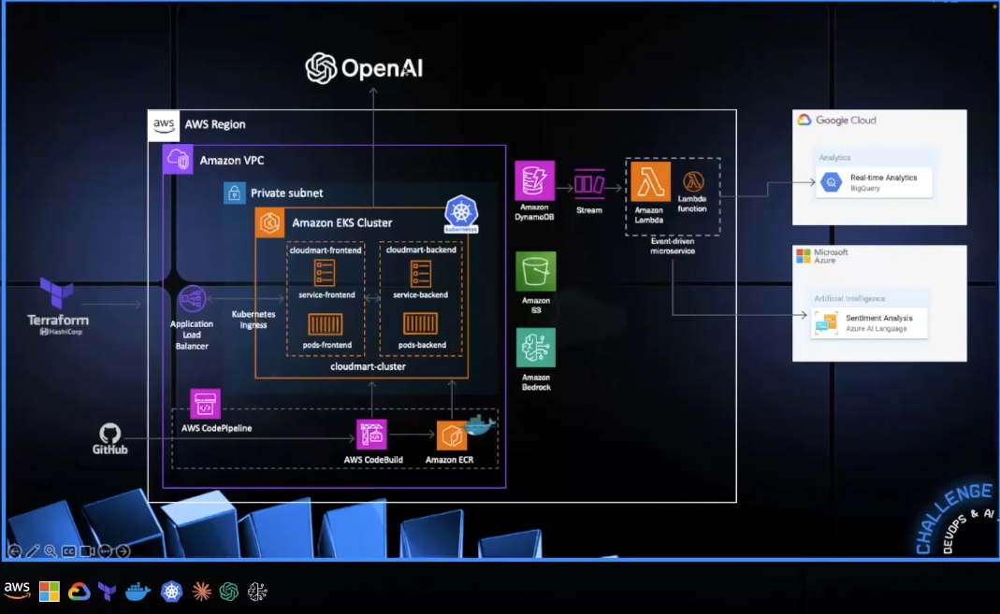

<p align="center">
  
  
# MULTICLOUD-DEVOPS-AND-AI-DEPLOYMENT-FOR-SCALABLE-MODEL-SERVING

---

# MultiCloud, DevOps & AI Challenge - Day 1 
## Automating AWS Provisioning with Terraform  

### Project Overview  
This project is part of the **MultiCloud, DevOps & AI Challenge**, where we use **Terraform** to automate the provisioning of **AWS services**. In this initial setup, we will create an **S3 bucket** and a **DynamoDB table**, which will serve as the foundation for future projects in this challenge.

---

## Technologies Used  

- **Terraform**  
- **Amazon Web Services (AWS)**  
- **GitHub Codespaces**  
- **S3 (Simple Storage Service)**  
- **DynamoDB**  

---

## Key Features  

- Automates the deployment of AWS services using Terraform.  
- Efficient infrastructure management with Infrastructure as Code (IaC).  
- Streamlines resource creation and eliminates manual configuration.  

---

## Step-by-Step Setup  

### Configuring the Repository  

Ensure you are using a **Linux environment** (refer to AWS documentation for installation on other OS).  

**Install AWS CLI:**  
```sh
curl "https://awscli.amazonaws.com/awscli-exe-linux-x86_64.zip" -o "awscliv2.zip"
unzip awscliv2.zip
sudo ./aws/install
```

**Configure AWS credentials:**  
```sh
aws configure
```
Enter:  
- **Access Key ID**  
- **Secret Access Key**  
- **Region** (e.g., `us-east-1`)  
- **Output Format** (`json` recommended)  

Verify credentials:  
```sh
aws sts get-caller-identity
```

**Install Terraform CLI:**  
```sh
sudo wget -O - https://apt.releases.hashicorp.com/gpg | sudo gpg --dearmor -o /usr/share/keyrings/hashicorp-archive-keyring.gpg
echo "deb [arch=$(dpkg --print-architecture) signed-by=/usr/share/keyrings/hashicorp-archive-keyring.gpg] https://apt.releases.hashicorp.com $(lsb_release -cs) main" | sudo tee /etc/apt/sources.list.d/hashicorp.list
sudo apt update && sudo apt install terraform
```

---

### Terraform Configuration  

**Create a project directory:**  
```sh
mkdir terraform-project && cd terraform-project
```

**Initialize Terraform:**  
```sh
terraform init
```

**Review the execution plan:**  
```sh
terraform plan
```

**Apply the Terraform configuration:**  
```sh
terraform apply
```
Confirm the deployment when prompted.

**Verify the created resources:**  
```sh
aws s3 ls
```

---

### Final Output  

After executing the above steps, the **S3 bucket** and **DynamoDB table** will be successfully created. You can also verify them in the **AWS Management Console**.

--- 

# MultiCloud, DevOps & AI Challenge - Day 2  
## Deploying Docker Images for an E-commerce Website with Kubernetes  

### Project Overview  
In this project, we will deploy the **CloudMart E-commerce website** using **Docker** and **Kubernetes**. We will build and push Docker images for both the **frontend** and **backend** to an **AWS Elastic Container Registry (ECR)** and then deploy them in a **Kubernetes Cluster (EKS)**.  

---

## Technologies Used  

- **Amazon Web Services (AWS)**  
- **GitHub Codespaces**  
- **Docker**  
- **Kubernetes**  
- **Elastic Kubernetes Service (EKS)**  
- **Elastic Container Registry (ECR)**  

---

## Key Features  

- **Containerization**: Build Docker images for frontend and backend services.  
- **Orchestration with Kubernetes**: Deploy services efficiently using Kubernetes.  
- **Scalability**: Utilize EKS for scalable and managed Kubernetes clusters.  
- **Infrastructure as Code (IaC)**: Automate deployment with YAML configurations.  

---

## Step-by-Step Setup  

### Setting Up the Environment  

Ensure you are using a **Linux environment** (refer to AWS documentation for installation on other OS).  

**Install AWS CLI:**  
```sh
curl "https://awscli.amazonaws.com/awscli-exe-linux-x86_64.zip" -o "awscliv2.zip"
unzip awscliv2.zip
sudo ./aws/install
```

**Configure AWS credentials:**  
```sh
aws configure
```
Enter:  
- **Access Key ID**  
- **Secret Access Key**  
- **Region** (e.g., `us-east-1`)  
- **Output Format** (`json` recommended)  

Verify credentials:  
```sh
aws sts get-caller-identity
```

**Install Kubernetes CLI (kubectl & eksctl):**  
```sh
# Install eksctl
curl --silent --location "https://github.com/weaveworks/eksctl/releases/latest/download/eksctl_$(uname -s)_amd64.tar.gz" | tar xz -C /tmp
sudo mv /tmp/eksctl /usr/local/bin

# Install kubectl
curl -LO "https://dl.k8s.io/release/$(curl -L -s https://dl.k8s.io/release/stable.txt)/bin/linux/amd64/kubectl"
chmod +x kubectl
sudo mv kubectl /usr/local/bin/
```

---

### Building Docker Images for CloudMart  

#### **Backend Setup**  
```sh
mkdir -p challenge-day2/backend && cd challenge-day2/backend
wget https://tcb-public-events.s3.amazonaws.com/mdac/resources/day2/cloudmart-backend.zip
unzip cloudmart-backend.zip
```

Create a `.env` file:  
```sh
nano .env
```
**Add the following details:**  
```
PORT=5000
AWS_REGION=us-east-1
BEDROCK_AGENT_ID=<your-bedrock-agent-id>
BEDROCK_AGENT_ALIAS_ID=<your-bedrock-agent-alias-id>
OPENAI_API_KEY=<your-openai-api-key>
OPENAI_ASSISTANT_ID=<your-openai-assistant-id>
```

#### **Frontend Setup**  
```sh
cd ..
mkdir frontend && cd frontend
wget https://tcb-public-events.s3.amazonaws.com/mdac/resources/day2/cloudmart-frontend.zip
unzip cloudmart-frontend.zip
```

#### **Dockerfile Configuration**  
```sh
nano Dockerfile
```
**Add the following content:**  
```dockerfile
FROM node:16-alpine as build
WORKDIR /app
COPY package*.json ./
RUN npm ci
COPY . .
RUN npm run build

FROM node:16-alpine
WORKDIR /app
RUN npm install -g serve
COPY --from=build /app/dist /app
ENV PORT=5001
ENV NODE_ENV=production
EXPOSE 5001
CMD ["serve", "-s", ".", "-l", "5001"]
```

---

### Creating the Kubernetes Cluster  

**Create an EKS cluster:**  
```sh
eksctl create cluster \
  --name cloudmart \
  --region us-east-1 \
  --nodegroup-name standard-workers \
  --node-type t3.medium \
  --nodes 1 \
  --with-oidc \
  --managed
```

**Connect to the EKS cluster:**  
```sh
aws eks update-kubeconfig --name cloudmart
```

**Verify Cluster Connectivity:**  
```sh
kubectl get svc
kubectl get nodes
```

**Create a Role & Service Account:**  
```sh
eksctl create iamserviceaccount \
  --cluster=cloudmart \
  --name=cloudmart-pod-execution-role \
  --role-name CloudMartPodExecutionRole \
  --attach-policy-arn=arn:aws:iam::aws:policy/AdministratorAccess \
  --region us-east-1 \
  --approve
```

---

### Deploying the Backend & Frontend with Kubernetes  

#### **Create AWS ECR Repositories**  
```sh
aws ecr create-repository --repository-name cloudmart-backend --region us-east-1
aws ecr create-repository --repository-name cloudmart-frontend --region us-east-1
```

#### **Create Backend Kubernetes Deployment**  
```sh
cd challenge-day2/backend
nano cloudmart-backend.yaml
```
**Add the following content:**  
```yaml
apiVersion: apps/v1
kind: Deployment
metadata:
  name: cloudmart-backend-app
spec:
  replicas: 1
  selector:
    matchLabels:
      app: cloudmart-backend-app
  template:
    metadata:
      labels:
        app: cloudmart-backend-app
    spec:
      serviceAccountName: cloudmart-pod-execution-role
      containers:
      - name: cloudmart-backend-app
        image: public.ecr.aws/l4c0j8h9/cloudmart-backend:latest
        env:
        - name: PORT
          value: "5000"
        - name: AWS_REGION
          value: "us-east-1"
        - name: BEDROCK_AGENT_ID
          value: "xxxxxx"
        - name: BEDROCK_AGENT_ALIAS_ID
          value: "xxxx"
        - name: OPENAI_API_KEY
          value: "xxxxxx"
        - name: OPENAI_ASSISTANT_ID
          value: "xxxx"

---

apiVersion: v1
kind: Service
metadata:
  name: cloudmart-backend-app-service
spec:
  type: LoadBalancer
  selector:
    app: cloudmart-backend-app
  ports:
    - protocol: TCP
      port: 5000
      targetPort: 5000
```

**Deploy the Backend:**  
```sh
kubectl apply -f cloudmart-backend.yaml
```

**Monitor Deployment Status:**  
```sh
kubectl get pods
kubectl get deployment
kubectl get service
```

---

#### **Deploying the Frontend Kubernetes Service**  
Update `.env` file with API URL:  
```sh
cd ../frontend
nano .env
```
**Add:**  
```
VITE_API_BASE_URL=http://<your_kubernetes_api_url>:5000/api
```

**Create Frontend Deployment File:**  
```sh
nano cloudmart-frontend.yaml
```
**Add the following content:**  
```yaml
apiVersion: apps/v1
kind: Deployment
metadata:
  name: cloudmart-frontend-app
spec:
  replicas: 1
  selector:
    matchLabels:
      app: cloudmart-frontend-app
  template:
    metadata:
      labels:
        app: cloudmart-frontend-app
    spec:
      serviceAccountName: cloudmart-pod-execution-role
      containers:
      - name: cloudmart-frontend-app
        image: public.ecr.aws/l4c0j8h9/cloudmart-frontend:latest

---

apiVersion: v1
kind: Service
metadata:
  name: cloudmart-frontend-app-service
spec:
  type: LoadBalancer
  selector:
    app: cloudmart-frontend-app
  ports:
    - protocol: TCP
      port: 5001
      targetPort: 5001
```

**Deploy the Frontend:**  
```sh
kubectl apply -f cloudmart-frontend.yaml
```

**Monitor Deployment:**  
```sh
kubectl get pods
kubectl get deployment
kubectl get service
```

---

## Conclusion  

By completing this project, we successfully deployed a **containerized E-commerce website** on AWS **Elastic Kubernetes Service (EKS)**. This setup enables **scalability**, **high availability**, and **efficient management** of both frontend and backend services using **Docker & Kubernetes**. 

--- 

# MultiCloud, DevOps & AI Challenge — Day 3 
## Automating CI/CD Pipeline for an E-Commerce Application  

### Project Overview  
In this project, we build and automate the **CI/CD pipeline** for our **CloudMart e-commerce application** using **AWS CodePipeline**. Every push to the GitHub repository will automatically trigger the **build, test, and deployment** process, ensuring a **seamless and continuous delivery** workflow.

---

## Technologies Used  

- **Amazon Web Services (AWS)**  
- **GitHub Codespaces**  
- **AWS CodePipeline**  
- **AWS CodeBuild**  
- **Docker**  
- **Amazon Elastic Container Registry (ECR)**  

---

## Key Features  

**Automated CI/CD Pipeline:**  
- Implements **AWS CodePipeline** to automate testing and deployment.  
- Ensures every push to GitHub triggers the pipeline for continuous integration and delivery.  

**Integration with GitHub:**  
- Uses **GitHub OAuth tokens** to securely integrate AWS CodePipeline with the repository.  
- Monitors changes in the **main branch** for automatic deployment.  

**Automated Builds with AWS CodeBuild:**  
- Defines build steps with **buildspec.yml** for dependency installation, testing, and packaging.  
- Builds Docker images and pushes them to **AWS ECR**.  

---

## 📖 Step-by-Step Setup  

### Setting Up the Environment  

Ensure you are using a **Linux environment** (refer to AWS documentation for installation on other OS).  

**Install AWS CLI:**  
```sh
curl "https://awscli.amazonaws.com/awscli-exe-linux-x86_64.zip" -o "awscliv2.zip"
unzip awscliv2.zip
sudo ./aws/install
```

**Configure AWS credentials:**  
```sh
aws configure
```
Enter:  
- **Access Key ID**  
- **Secret Access Key**  
- **Region** (e.g., `us-east-1`)  
- **Output Format** (`json` recommended)  

Verify credentials:  
```sh
aws sts get-caller-identity
```

**Install Docker CLI for GitHub Codespaces:**  
```sh
curl -fsSL https://download.docker.com/linux/static/stable/x86_64/docker-20.10.9.tgz -o docker.tgz
tar -xzf docker.tgz
sudo mv docker/docker /usr/local/bin/
rm -rf docker docker.tgz
```

For **GitHub Codespaces**, enable **Docker-in-Docker**:  
1. **Ctrl + P** in Codespace  
2. **Add Dev Container Config Files**  
3. **Modify Configuration > Enable Docker-in-Docker**  

---

### Cloning the Repository & Configuring AWS CodePipeline  

**Clone the CloudMart frontend repository:**  
```sh
gh repo clone nilsojc/multicloud2
```

#### **Set Up AWS CodePipeline**  
1. Go to **GitHub > Settings > Developer Settings > Classic Tokens**  
2. Generate an **API key** for AWS CodePipeline to access the repo.  

**Create a new AWS CodePipeline:**  
```sh
aws codepipeline create-pipeline --region us-east-1 --cli-input-json file://pipeline.json
```
> Replace API keys and resource names inside the `pipeline.json` file.

#### **Set Up AWS CodeBuild for Docker Image Builds**  
```sh
aws codebuild create-project \
    --name cloudmartBuild \
    --source '{
        "type": "GITHUB",
        "location": "https://github.com/MashrurWasek/cloudmart.git",
        "gitCloneDepth": 1,
        "buildspec": "buildspec.yml"
    }' \
    --artifacts '{
        "type": "NO_ARTIFACTS"
    }' \
    --environment '{
        "type": "LINUX_CONTAINER",
        "image": "aws/codebuild/amazonlinux2-x86_64-standard:4.0",
        "computeType": "BUILD_GENERAL1_SMALL",
        "privilegedMode": true,
        "environmentVariables": [
            {
                "name": "ECR_REPO",
                "value": "your-ecr-repo-uri"
            }
        ]
    }' \
    --service-role arn:aws:iam::your-account-id:role/your-codebuild-role \
    --region us-east-1
```

#### **Define Build Specification File (buildspec.yml)**  
```yaml
version: 0.2
phases:
  install:
    runtime-versions:
      docker: 20
  pre_build:
    commands:
      - echo Logging in to Amazon ECR...
      - aws --version
      - REPOSITORY_URI=$ECR_REPO
      - aws ecr-public get-login-password --region us-east-1 | docker login --username AWS --password-stdin public.ecr.aws/l4c0j8h9
  build:
    commands:
      - echo Build started on `date`
      - echo Building the Docker image...
      - docker build -t $REPOSITORY_URI:latest .
      - docker tag $REPOSITORY_URI:latest $REPOSITORY_URI:$CODEBUILD_RESOLVED_SOURCE_VERSION
  post_build:
    commands:
      - echo Build completed on `date`
      - echo Pushing the Docker image...
      - docker push $REPOSITORY_URI:latest
      - docker push $REPOSITORY_URI:$CODEBUILD_RESOLVED_SOURCE_VERSION
      - export imageTag=$CODEBUILD_RESOLVED_SOURCE_VERSION
      - printf '[{\"name\":\"cloudmart-app\",\"imageUri\":\"%s\"}]' $REPOSITORY_URI:$imageTag > imagedefinitions.json
      - cat imagedefinitions.json
      - ls -l
artifacts:
  files:
    - imagedefinitions.json
    - cloudmart-frontend.yaml
```

---

### Automating Deployment to Production  

**Create AWS CodeBuild Project for Deployment:**  
```sh
aws codebuild create-project \
    --name cloudmartDeployToProduction \
    --source '{
        "type": "GITHUB",
        "location": "yourgithublocation",
        "gitCloneDepth": 1,
        "buildspec": "buildspec-deploy.yml"
    }' \
    --artifacts '{
        "type": "NO_ARTIFACTS"
    }' \
    --environment '{
        "type": "LINUX_CONTAINER",
        "image": "aws/codebuild/amazonlinux2-x86_64-standard:4.0",
        "computeType": "BUILD_GENERAL1_SMALL",
        "privilegedMode": true,
        "environmentVariables": [
            {
                "name": "ECR_REPO",
                "value": "your-ecr-repo-id"
            },
            {
                "name": "AWS_ACCESS_KEY_ID",
                "value": "<your-eks-user-access-key>",
                "type": "PLAINTEXT"
            },
            {
                "name": "AWS_SECRET_ACCESS_KEY",
                "value": "<your-eks-user-secret-key>",
                "type": "PLAINTEXT"
            }
        ]
    }' \
    --service-role Cloudmartrole \
    --region us-east-1
```
> **PSA**: For real-world applications, **use IAM roles instead of credentials** for security best practices.

#### **Define Deployment Specification (buildspec-deploy.yml)**  
```yaml
version: 0.2
phases:
  install:
    runtime-versions:
      docker: 20
    commands:
      - curl -o kubectl https://amazon-eks.s3.us-east-1.amazonaws.com/1.18.9/2020-11-02/bin/linux/amd64/kubectl
      - chmod +x ./kubectl
      - mv ./kubectl /usr/local/bin
      - kubectl version --short --client
  post_build:
    commands:
      - aws eks update-kubeconfig --region us-east-1 --name cloudmart
      - kubectl get nodes
      - IMAGE_URI=$(jq -r '.[0].imageUri' imagedefinitions.json)
      - echo $IMAGE_URI
      - sed -i "s|CONTAINER_IMAGE|$IMAGE_URI|g" cloudmart-frontend.yaml
      - kubectl apply -f cloudmart-frontend.yaml
```

---

### Testing the CI/CD Pipeline  

**Make a code change & push it to GitHub:**  
```sh
git add -A
git commit -m "Updated Featured Products on CloudMart"
git push
```

**Monitor the Pipeline Execution:**  
- CodePipeline will trigger the **build** & **deployment** process.  
- Use **kubectl** to verify deployment:  
```sh
kubectl get pods
kubectl get deployment
kubectl get service
```

---

## Conclusion  

This project successfully implemented a **CI/CD pipeline** using **AWS CodePipeline & CodeBuild**, enabling **automated testing and deployment** of an **e-commerce application**. This **cloud-native DevOps workflow** ensures fast and efficient **continuous integration & deployment (CI/CD)**.

---

# MultiCloud, DevOps & AI Challenge — Day 4  
## Deploying AI Agents in the CloudMart E-Commerce Application  

### Project Overview  
In this project, we integrated **AI agents** into the **CloudMart e-commerce application** using a **multi-cloud and DevOps approach**. By leveraging **Amazon Bedrock, OpenAI, Terraform, Docker, and Kubernetes**, we built a scalable and intelligent system that enhances **product recommendations** and **customer interactions**.  

---

## Technologies Used  

- **Amazon Web Services (AWS)**  
- **GitHub Codespaces**  
- **Amazon Bedrock**  
- **OpenAI Assistants API**  
- **Docker**  
- **Terraform**  

---

## Key Features  

**Terraform-based Infrastructure Deployment:**  
- Automated **DynamoDB**, **IAM Roles**, and **Lambda functions** for CloudMart.  

**AI-powered Product Recommendations & Support:**  
- Integrated **Amazon Bedrock (Claude 3 Sonnet)** for AI-driven recommendations.  
- Connected **OpenAI Assistants API (GPT-4o)** for customer interactions.  

**Seamless Deployment with Docker & Kubernetes:**  
- Built **Docker images** and pushed them to **ECR**.  
- Deployed updates using **Kubernetes clusters**.  

---

## Step-by-Step Setup  

### Setting Up the Environment  

Ensure you are using a **Linux environment** (refer to AWS documentation for installation on other OS).  

**Install AWS CLI:**  
```sh
curl "https://awscli.amazonaws.com/awscli-exe-linux-x86_64.zip" -o "awscliv2.zip"
unzip awscliv2.zip
sudo ./aws/install
```

**Configure AWS credentials:**  
```sh
aws configure
```
Enter:  
- **Access Key ID**  
- **Secret Access Key**  
- **Region** (e.g., `us-east-1`)  
- **Output Format** (`json` recommended)  

Verify credentials:  
```sh
aws sts get-caller-identity
```

**Install Terraform:**  
```sh
sudo wget -O - https://apt.releases.hashicorp.com/gpg | sudo gpg --dearmor -o /usr/share/keyrings/hashicorp-archive-keyring.gpg
echo "deb [arch=$(dpkg --print-architecture) signed-by=/usr/share/keyrings/hashicorp-archive-keyring.gpg] https://apt.releases.hashicorp.com $(lsb_release -cs) main" | sudo tee /etc/apt/sources.list.d/hashicorp.list
sudo apt update && sudo apt install terraform
```

**Install Docker CLI for GitHub Codespaces:**  
```sh
curl -fsSL https://download.docker.com/linux/static/stable/x86_64/docker-20.10.9.tgz -o docker.tgz
tar -xzf docker.tgz
sudo mv docker/docker /usr/local/bin/
rm -rf docker docker.tgz
```

For **GitHub Codespaces**, enable **Docker-in-Docker**:  
1. **Ctrl + P** in Codespace  
2. **Add Dev Container Config Files**  
3. **Modify Configuration > Enable Docker-in-Docker**  

---

### Deploying Resources using Terraform  

**Clone the CloudMart repository:**  
```sh
gh repo clone nilsojc/multicloud2
```

**Deploy the `main.tf` file for Terraform:**  
```hcl
provider "aws" {
  region = "us-east-1"
}

# DynamoDB Tables
resource "aws_dynamodb_table" "cloudmart_products" {
  name         = "cloudmart_products"
  billing_mode = "PAY_PER_REQUEST"
  hash_key     = "product_id"

  attribute {
    name = "product_id"
    type = "S"
  }
}

resource "aws_dynamodb_table" "cloudmart_orders" {
  name         = "cloudmart_orders"
  billing_mode = "PAY_PER_REQUEST"
  hash_key     = "order_id"

  attribute {
    name = "order_id"
    type = "S"
  }
}

# IAM Role for Lambda functions
resource "aws_iam_role" "lambda_role" {
  name = "cloudmart_lambda_role"

  assume_role_policy = jsonencode({
    Version = "2012-10-17"
    Statement = [{
      Action = "sts:AssumeRole"
      Effect = "Allow"
      Principal = { Service = "lambda.amazonaws.com" }
    }]
  })
}

# Lambda function for listing products
resource "aws_lambda_function" "list_products" {
  filename         = "list_products.zip"
  function_name    = "cloudmart-list-products"
  role             = aws_iam_role.lambda_role.arn
  handler          = "index.handler"
  runtime          = "nodejs20.x"
  source_code_hash = filebase64sha256("list_products.zip")

  environment {
    variables = {
      PRODUCTS_TABLE = aws_dynamodb_table.cloudmart_products.name
    }
  }
}

# Allow Bedrock to invoke Lambda
resource "aws_lambda_permission" "allow_bedrock" {
  statement_id  = "AllowBedrockInvoke"
  action        = "lambda:InvokeFunction"
  function_name = aws_lambda_function.list_products.function_name
  principal     = "bedrock.amazonaws.com"
}
```

**Deploy Terraform Configuration:**  
```sh
terraform init
terraform apply -auto-approve
```

---

### Configuring AI Agents in Amazon Bedrock  

**Create a Bedrock AI Agent using Claude 3 Sonnet:**  
```sh
aws bedrock-agent create-agent \
  --agent-name cloudmart-product-recommendation-agent \
  --agent-resource-role-arn arn:aws:iam::137068224350:role/Cloudmart \
  --foundation-model anthropic.claude-v3 \
  --instruction file://agents.yaml
```

**Set IAM access for Lambda invocation:**  
```sh
aws iam put-role-policy --role-name Cloudmart \
  --policy-name BedrockAgentLambdaAccess \
  --policy-document file://policy.json
```

**Prepare & Alias AI Agent:**  
```sh
aws bedrock-agent prepare-agent --agent-id <your-agent-id>
aws bedrock-agent create-agent-alias \
    --agent-id "<your-agent-id>" \
    --agent-alias-name "cloudmart-prod" \
    --description "CloudMart AI Agent"
```

---

### Integrating OpenAI Assistants API  

1. **Log into** [OpenAI Platform](https://platform.openai.com/)  
2. **Create a new Assistant** (GPT-4o)  
3. **Save the Assistant ID**  
4. **Generate an API Key**  

Add these to your `.env` file:  
```env
OPENAI_API_KEY=<your-openai-api-key>
OPENAI_ASSISTANT_ID=<your-openai-assistant-id>
```

---

### Redeploy Backend with AI Assistants  

**Modify CloudMart Backend Deployment (`cloudmart-backend.yaml`):**  
```yaml
apiVersion: apps/v1
kind: Deployment
metadata:
  name: cloudmart-backend-app
spec:
  replicas: 1
  selector:
    matchLabels:
      app: cloudmart-backend-app
  template:
    metadata:
      labels:
        app: cloudmart-backend-app
    spec:
      serviceAccountName: cloudmart-pod-execution-role
      containers:
      - name: cloudmart-backend-app
        image: public.ecr.aws/l4c0j8h9/cloudmart-backend:latest
        env:
        - name: BEDROCK_AGENT_ID
          value: "<your-bedrock-agent-id>"
        - name: OPENAI_API_KEY
          value: "<your-openai-api-key>"
        - name: OPENAI_ASSISTANT_ID
          value: "<your-openai-assistant-id>"
```

**Apply the changes in Kubernetes:**  
```sh
kubectl apply -f cloudmart-backend.yaml
```

---

## Conclusion  

This project successfully integrated **AI-powered recommendations and customer support** into the **CloudMart E-commerce platform**. By using **Amazon Bedrock (Claude 3 Sonnet)** and **OpenAI (GPT-4o)**, the application can provide **personalized recommendations** and **assist customers in real-time**.  

- **Terraform** ensured **automated and scalable infrastructure** deployment.  
- **Docker & Kubernetes** streamlined **containerization and orchestration**.  
- **AWS Lambda & DynamoDB** enhanced **serverless processing & data storage**.  

This implementation demonstrates **multi-cloud AI integration**, combining **AWS and OpenAI** for **real-time, intelligent customer interactions** in an e-commerce setting.

--- 

# MultiCloud, DevOps & AI Challenge — Day 5  
## Implementing Analytics & Deploying CloudMart to Production  

### Project Overview  
For the final day of the **MultiCloud, DevOps & AI Challenge**, I implemented **analytics integration** and **deployed CloudMart to production** using a **multi-cloud approach** with **AWS, Google Cloud, and Azure**. This involved:  
Updating frontend & backend code based on testing feedback.  
Integrating **Google BigQuery** for analytics and insights.  
Using **Azure Text Analytics** for customer sentiment analysis.  
Deploying updated **backend services** to **ECR & Kubernetes**.  

---

## Technologies Used  

- **Google Cloud Platform (GCP) — BigQuery**  
- **Microsoft Azure — Text Analytics**  
- **Amazon Web Services (AWS) — ECR, Lambda, Kubernetes**  
- **Terraform — Infrastructure as Code**  

---

## Key Features  

**Data Analytics with Google BigQuery:**  
- Captured **real-time order data** from **DynamoDB** to **BigQuery** for analysis.  

**Sentiment Analysis with Azure Text Analytics:**  
- Integrated **Azure AI** to analyze customer reviews & feedback.  

**Scalable Infrastructure with AWS:**  
- **Backend containerized & deployed** via **ECR & Kubernetes**.  
- **Lambda functions** triggered on **DynamoDB updates** for analytics.  

---

## Step-by-Step Setup  

### Configuring Google Cloud BigQuery  

**Enable BigQuery API in Google Cloud Console:**  
1. Go to **Google Cloud Console** → **API & Services**.  
2. Search for **BigQuery API** and **enable it**.  

**Create a Dataset & Table in BigQuery:**  
1. Open **BigQuery Console**.  
2. Create a **Dataset** named **`cloudmart`**.  
3. Create a **Table** named **`orders`** with schema:  
   - `order_id (STRING)`  
   - `customer_name (STRING)`  
   - `total_amount (FLOAT)`  
   - `order_status (STRING)`  
   - `created_at (TIMESTAMP)`  

**Create a Service Account for BigQuery:**  
1. Navigate to **IAM & Admin** → **Service Accounts**.  
2. Create a new **Service Account** (`cloudmart-bigquery-sa`).  
3. Assign **BigQuery Data Editor** role.  
4. Generate **JSON Key** (`google_credentials.json`).  

**Update CloudMart Backend to Use BigQuery:**  
```sh
cd challenge-day2/backend/src/lambda/addToBigQuery
sudo yum install npm
npm install
zip -r dynamodb_to_bigquery.zip .
```

---

### Deploying Resources with Terraform  

**Ensure Terraform is installed:**  
```sh
terraform --version
```

**Define AWS Infrastructure in `main.tf`:**  
```hcl
provider "aws" {
  region = "us-east-1"
}

# DynamoDB Tables
resource "aws_dynamodb_table" "cloudmart_orders" {
  name         = "cloudmart-orders"
  billing_mode = "PAY_PER_REQUEST"
  hash_key     = "id"

  attribute {
    name = "id"
    type = "S"
  }

  stream_enabled   = true
  stream_view_type = "NEW_AND_OLD_IMAGES"
}

# IAM Role for Lambda
resource "aws_iam_role" "lambda_role" {
  name = "cloudmart_lambda_role"

  assume_role_policy = jsonencode({
    Version = "2012-10-17"
    Statement = [{
      Action = "sts:AssumeRole"
      Effect = "Allow"
      Principal = { Service = "lambda.amazonaws.com" }
    }]
  })
}

# Lambda function for pushing orders to BigQuery
resource "aws_lambda_function" "dynamodb_to_bigquery" {
  filename         = "../challenge-day2/backend/src/lambda/addToBigQuery/dynamodb_to_bigquery.zip"
  function_name    = "cloudmart-dynamodb-to-bigquery"
  role             = aws_iam_role.lambda_role.arn
  handler          = "index.handler"
  runtime          = "nodejs20.x"
  source_code_hash = filebase64sha256("../challenge-day2/backend/src/lambda/addToBigQuery/dynamodb_to_bigquery.zip")

  environment {
    variables = {
      GOOGLE_CLOUD_PROJECT_ID        = "your-gcp-project-id"
      BIGQUERY_DATASET_ID            = "cloudmart"
      BIGQUERY_TABLE_ID              = "orders"
      GOOGLE_APPLICATION_CREDENTIALS = "/var/task/google_credentials.json"
    }
  }
}

# Lambda Event Source Mapping for DynamoDB Stream
resource "aws_lambda_event_source_mapping" "dynamodb_stream" {
  event_source_arn  = aws_dynamodb_table.cloudmart_orders.stream_arn
  function_name     = aws_lambda_function.dynamodb_to_bigquery.arn
  starting_position = "LATEST"
}
```

**Deploy the Infrastructure:**  
```sh
terraform init
terraform apply -auto-approve
```

---

### Setting Up Azure Text Analytics  

1. Log in to **Azure Portal**.  
2. Search **Text Analytics** and create a **new resource**.  
3. Navigate to **Keys and Endpoint** → **Copy API Key & Endpoint**.  
4. Store these values in `cloudmart-backend.yaml`.  

---

### Deploying CloudMart Backend & Kubernetes Updates  

#### **Update Kubernetes Deployment (`cloudmart-backend.yaml`):**  
```yaml
apiVersion: apps/v1
kind: Deployment
metadata:
  name: cloudmart-backend-app
spec:
  replicas: 1
  selector:
    matchLabels:
      app: cloudmart-backend-app
  template:
    metadata:
      labels:
        app: cloudmart-backend-app
    spec:
      serviceAccountName: cloudmart-pod-execution-role
      containers:
      - name: cloudmart-backend-app
        image: public.ecr.aws/l4c0j8h9/cloudmart-backend:latest
        env:
        - name: PORT
          value: "5000"
        - name: AWS_REGION
          value: "us-east-1"
        - name: GOOGLE_CLOUD_PROJECT_ID
          value: "your-gcp-project-id"
        - name: AZURE_ENDPOINT
          value: "your-azure-endpoint"
        - name: AZURE_API_KEY
          value: "your-azure-api-key"
---
apiVersion: v1
kind: Service
metadata:
  name: cloudmart-backend-app-service
spec:
  type: LoadBalancer
  selector:
    app: cloudmart-backend-app
  ports:
    - protocol: TCP
      port: 5000
      targetPort: 5000
```

#### **Build & Push Docker Image to AWS ECR:**  
```sh
aws ecr-public get-login-password --region us-east-1 | docker login --username AWS --password-stdin public.ecr.aws/l4c0j8h9
docker build -t cloudmart-backend .
docker tag cloudmart-backend:latest public.ecr.aws/l4c0j8h9/cloudmart-backend:latest
docker push public.ecr.aws/l4c0j8h9/cloudmart-backend:latest
```

#### **Deploy Backend to Kubernetes:**  
```sh
kubectl apply -f cloudmart-backend.yaml
```

---

## Conclusion  

The **CloudMart e-commerce platform** is now **production-ready**, with **analytics integration** and **scalable cloud deployment** across **AWS, Google Cloud, and Azure**.  

- **Google BigQuery** enables **real-time order tracking & analytics**.  
- **Azure Text Analytics** enhances **customer sentiment analysis**.  
- **AWS Lambda & DynamoDB Streams** automate **data processing**.  
- **Terraform** ensures **repeatable & automated cloud deployment**.  
- **Docker & Kubernetes** enable **scalable microservices architecture**.  

This **multi-cloud DevOps solution** successfully integrates **AI, analytics, and automation** to enhance **business intelligence and user experience** for **CloudMart**. 


